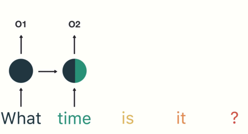
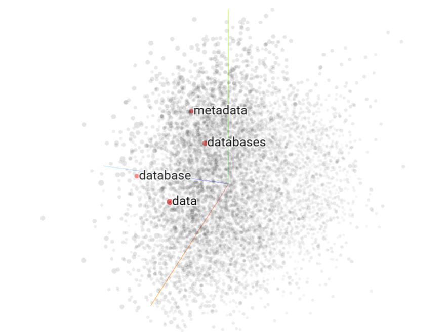

# Procesamiento de Lenguaje Natural I - FIUBA

  

Repositorio de la asignatura Procesamiento del Lenguaje Natural 1 (FIUBA) con los desafíos prácticos trabajados durante el curso. Técnicas de vectorización, embeddings, generación de secuencias y modelos seq2seq.

## Proyectos de NLP

<table align="center">
<tr>
  <td align="center">
    <a href="https://github.com/qagustina/PLN1/tree/main/desafio_1">
       
      <b>Clasificación de documentos</b>
    </a> 
    <b>TF-IDF. Similitud del coseno. Naive Bayes.</b>
  </td>
  <td align="center">
    <a href="https://github.com/qagustina/PLN1/tree/main/desafio_2">
       
      <b>Word embeddings</b>
    </a> 
    <b>Word2Vec. TSNE.</b>
  </td>
</tr>
<tr>
  <td align="center">
    <a href="https://github.com/qagustina/PLN1/tree/main/desafio_3">
       
      <b>Generación de secuencias</b>
    </a> 
    <b>Perplexity. LSTM, GRU, SimpleRNN.</b>
  </td>
  <td align="center">
    <a href="https://github.com/qagustina/PLN1/tree/main/desafio_4">
       
      <b>Modelos seq2seq</b>
    </a> 
    <b>Encoder-Decoder LSTM</b>
  </td>
</tr>
</table>

